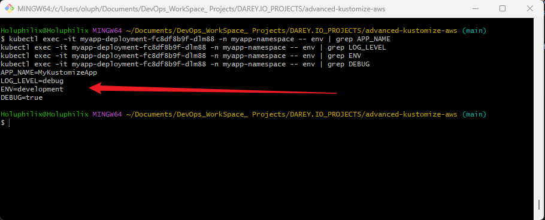
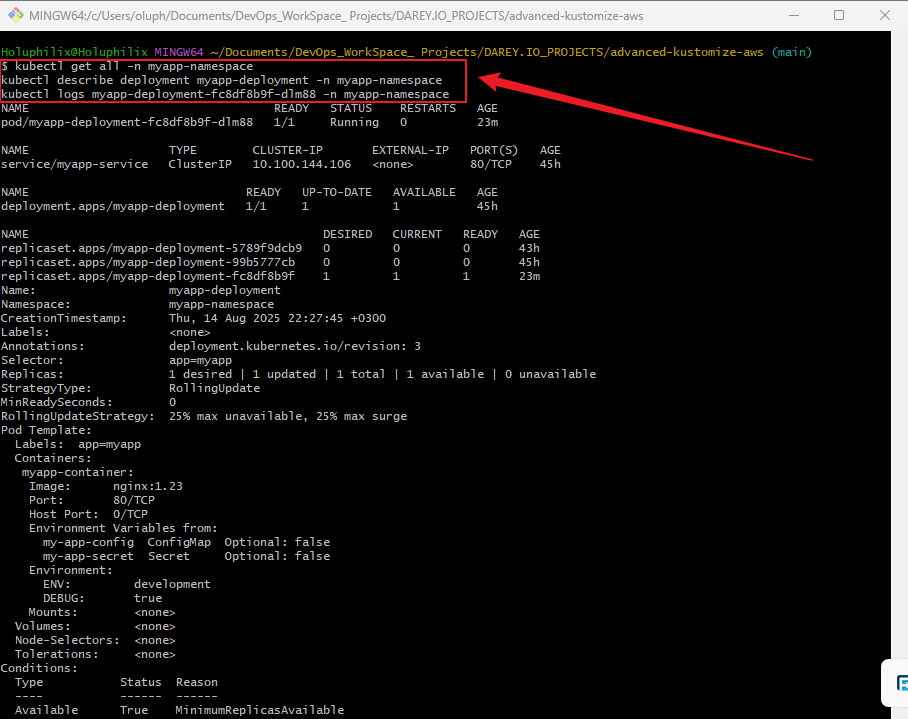
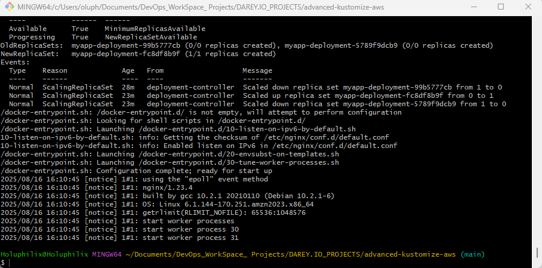
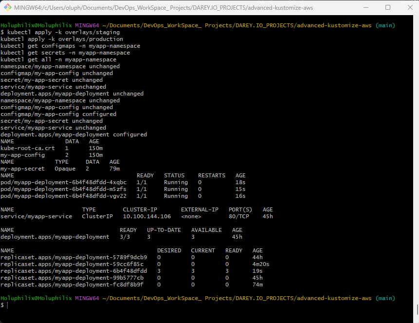
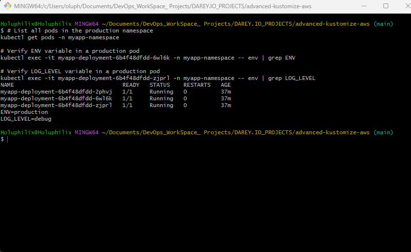

# **Advanced Kubernetes Configuration Management with Kustomize, AWS EKS, and GitHub Actions**

## **Project Overview**

This project focuses on implementing advanced Kubernetes configuration management techniques using **Kustomize** integrated with a **CI/CD pipeline** for automated deployments on **Amazon Elastic Kubernetes Service (EKS)**. It covers structuring complex Kubernetes configurations, managing environment-specific overlays, and applying best practices for performance, maintainability, and security.

## **Why is This Project Relevant**

In modern cloud-native environments, Kubernetes configurations often become complex as applications scale across multiple environments. This project equips engineers with the skills to:

* Manage large-scale Kubernetes configurations efficiently.
* Automate deployments through CI/CD pipelines.
* Implement secure and scalable configuration management practices.
* Leverage AWS infrastructure for real-world production-ready deployments.

This is like moving from playing a single instrument to conducting an entire orchestra—ensuring all application components work harmoniously in a secure and automated way.

## **Project Goals and Objectives**

**Goals:**

* Design and implement a production-ready Kubernetes configuration management workflow using Kustomize.
* Integrate Kustomize deployments into a CI/CD pipeline.
* Deploy applications to Amazon EKS with automated processes.

**Objectives:**

1. Structure a Kubernetes project with base and overlay configurations.
2. Automate configuration deployment using GitHub Actions.
3. Handle complex configurations using Kustomize features (patches, generators, overlays).
4. Apply best practices for performance, security, and maintainability.
5. Integrate AWS EKS for hosting workloads.

## **Prerequisites**

Before starting, ensure the following:

1. **Basic Understanding of Kubernetes and Kustomize**

   * Kubernetes concepts, deployments, services, and manifests.
   * Kustomize basics for customizing configurations.
2. **Installed Tools:**

   * [Kustomize](https://kubectl.docs.kubernetes.io/installation/kustomize/)
   * [Docker](https://docs.docker.com/get-docker/)
   * [kubectl](https://kubernetes.io/docs/tasks/tools/)
   * [AWS CLI](https://docs.aws.amazon.com/cli/latest/userguide/getting-started-install.html)
3. **AWS EKS Cluster Setup** via `eksctl` or AWS Management Console.
4. **CI/CD Platform**: GitHub Actions, Jenkins, or AWS CodePipeline.
5. **Code Editor**: Visual Studio Code with Kubernetes and YAML extensions.
6. **GitHub Account** for version control.

## **Project Deliverables**

* GitHub repository containing:

  * Base Kubernetes manifests.
  * Environment-specific overlays (dev, staging, production).
  * CI/CD workflow file for automated deployment.
* Deployed application on Amazon EKS.
* ConfigMap and Secret generators for environment variables and sensitive data.
* Documentation of best practices and configuration management strategy.

## **Tools & Technologies Used**

* **Kubernetes** (Configuration Management & Orchestration)
* **Kustomize** (Manifest Customization)
* **Docker** (Containerization)
* **kubectl** (Kubernetes CLI Tool)
* **AWS EKS** (Managed Kubernetes Service)
* **AWS CLI** (AWS Command-Line Interface)
* **GitHub Actions** (CI/CD)
* **eksctl** (EKS Cluster Management)
* **VS Code** (Code Editing)

## **Project Components**

1. **Base Configurations** – Common Kubernetes manifests used across all environments.
2. **Overlays** – Environment-specific configurations (development, staging, production).
3. **CI/CD Pipeline** – GitHub Actions workflow for automated deployment.
4. **AWS EKS Integration** – Deployment of workloads to EKS.
5. **Configuration Generators** – ConfigMaps and Secrets for dynamic and sensitive values.
6. **Best Practices** – Performance optimization, GitOps workflow, and secure configuration handling.

## **Task 1: Create Project Directory and Initial Structure**

### Objective:

Set up the complete project directory structure with essential base Kubernetes manifests, overlay folders with minimal configuration, CI/CD workflow placeholder, images folder, and README.md file for documentation.

### Step 1: Create main project directory and subdirectories

```bash
mkdir advanced-kustomize-aws
cd advanced-kustomize-aws
mkdir -p base overlays/development overlays/staging overlays/production .github/workflows images
```

### Step 2: Create base Kubernetes manifest files and kustomization file

```bash
touch base/deployment.yaml
touch base/namespace.yaml
touch base/service.yaml
touch base/kustomization.yaml
```

### Step 3: Create minimal overlay kustomization files referencing base

```bash
echo "resources:
  - ../../base" > overlays/development/kustomization.yaml

echo "resources:
  - ../../base" > overlays/staging/kustomization.yaml

echo "resources:
  - ../../base" > overlays/production/kustomization.yaml
```

### Step 4: Create CI/CD workflow placeholder and README.md

```bash
touch .github/workflows/main.yml
touch README.md
```

### Step 5: Verify the project structure

```bash
tree .
```

### Expected Project Structure:

```
advanced-kustomize-aws/
├── base/
│   ├── deployment.yaml
│   ├── namespace.yaml
│   ├── service.yaml
│   └── kustomization.yaml
├── overlays/
│   ├── development/
│   │   └── kustomization.yaml
│   ├── staging/
│   │   └── kustomization.yaml
│   └── production/
│       └── kustomization.yaml
├── .github/
│   └── workflows/
│       └── main.yml
├── images/
└── README.md
```

## **Task 2: Create Base Kubernetes Manifests**

**Goal:**
Define reusable Kubernetes configurations in the `base/` directory that overlays will inherit and customize.

### 1️⃣ **`base/namespace.yaml`**

This defines the namespace for your application resources.

```yaml
apiVersion: v1
kind: Namespace
metadata:
  name: myapp-namespace
```

### 2️⃣ **`base/deployment.yaml`**

This defines the deployment for your application.

```yaml
apiVersion: apps/v1
kind: Deployment
metadata:
  name: myapp-deployment
  namespace: myapp-namespace
spec:
  replicas: 2
  selector:
    matchLabels:
      app: myapp
  template:
    metadata:
      labels:
        app: myapp
    spec:
      containers:
        - name: myapp-container
          image: nginx:1.25
          ports:
            - containerPort: 80
```

### 3️⃣ **`base/service.yaml`**

This defines the service that exposes your app.

```yaml
apiVersion: v1
kind: Service
metadata:
  name: myapp-service
  namespace: myapp-namespace
spec:
  selector:
    app: myapp
  ports:
    - port: 80
      targetPort: 80
  type: ClusterIP
```

### 4️⃣ **`base/kustomization.yaml`**

This file ties everything in `base/` together.

```yaml
resources:
  - namespace.yaml
  - deployment.yaml
  - service.yaml
```

### ✅ Final `base/` Directory Structure

```
base/
├── deployment.yaml
├── namespace.yaml
├── service.yaml
└── kustomization.yaml
```

## **Task 3: Create Environment-Specific Overlays**

### Objective:

Organize Kubernetes manifests using Kustomize overlays so that each environment (development, staging, production) can have its own configuration. For example, different replica counts, image versions, or environment variables,  while still reusing a common base.

### Step 1: Update each overlay’s `kustomization.yaml` to reference base and add patches

We will add example patches to customize:

* Replica count
* Container image tag

### 2️⃣ Create patch files for each environment

**For `development`:**

Create `overlays/development/replica-patch.yaml`:

```yaml
apiVersion: apps/v1
kind: Deployment
metadata:
  name: myapp-deployment
  namespace: myapp-namespace
spec:
  replicas: 1
```

Create `overlays/development/image-patch.yaml`:

```yaml
apiVersion: apps/v1
kind: Deployment
metadata:
  name: myapp-deployment
  namespace: myapp-namespace
spec:
  template:
    spec:
      containers:
      - name: myapp-container
        image: nginx:1.23
```

**Update `overlays/development/kustomization.yaml`:**

```yaml
resources:
  - ../../base

patches:
  - path: replica-patch.yaml
    target:
      kind: Deployment
      name: myapp-deployment
  - path: image-patch.yaml
    target:
      kind: Deployment
      name: myapp-deployment
```

**For `staging`:**

Create `overlays/staging/replica-patch.yaml`:

```yaml
apiVersion: apps/v1
kind: Deployment
metadata:
  name: myapp-deployment
  namespace: myapp-namespace
spec:
  replicas: 2
```

Create `overlays/staging/image-patch.yaml`:

```yaml
apiVersion: apps/v1
kind: Deployment
metadata:
  name: myapp-deployment
  namespace: myapp-namespace
spec:
  template:
    spec:
      containers:
      - name: myapp-container
        image: nginx:1.24
```

**Update `overlays/staging/kustomization.yaml`:**

```yaml
resources:
  - ../../base

patches:
  - path: replica-patch.yaml
    target:
      kind: Deployment
      name: myapp-deployment
  - path: image-patch.yaml
    target:
      kind: Deployment
      name: myapp-deployment
```

**For `production`:**

Create `overlays/production/replica-patch.yaml`:

```yaml
apiVersion: apps/v1
kind: Deployment
metadata:
  name: myapp-deployment
  namespace: myapp-namespace
spec:
  replicas: 3
```

Create `overlays/production/image-patch.yaml`:

```yaml
apiVersion: apps/v1
kind: Deployment
metadata:
  name: myapp-deployment
  namespace: myapp-namespace
spec:
  template:
    spec:
      containers:
      - name: myapp-container
        image: nginx:1.25
```

**Update `overlays/production/kustomization.yaml`:**

```yaml
resources:
  - ../../base

patches:
  - path: replica-patch.yaml
    target:
      kind: Deployment
      name: myapp-deployment
  - path: image-patch.yaml
    target:
      kind: Deployment
      name: myapp-deployment
```

### Step 2: Resulting overlay directory structure example

```
overlays/
├── development/
│   ├── kustomization.yaml
│   ├── replica-patch.yaml
│   └── image-patch.yaml
├── staging/
│   ├── kustomization.yaml
│   ├── replica-patch.yaml
│   └── image-patch.yaml
└── production/
    ├── kustomization.yaml
    ├── replica-patch.yaml
    └── image-patch.yaml
```

### Step 3: Verify overlays locally

You can test your overlays by running:

```bash
kubectl kustomize overlays/development
kubectl kustomize overlays/staging
kubectl kustomize overlays/production
```
These commands output the fully rendered manifests for each environment.

```yaml
Holuphilix@Holuphilix MINGW64 ~/Documents/DevOps_WorkSpace_ Projects/DAREY.IO_PROJECTS/advanced-kustomize-aws
$ kubectl kustomize overlays/development
kubectl kustomize overlays/staging
kubectl kustomize overlays/production
apiVersion: v1
kind: Namespace
metadata:
  name: myapp-namespace
---
apiVersion: v1
kind: Service
metadata:
  name: myapp-service
  namespace: myapp-namespace
spec:
  ports:
  - port: 80
    targetPort: 80
  selector:
    app: myapp
  type: ClusterIP
---
apiVersion: apps/v1
kind: Deployment
metadata:
  name: myapp-deployment
  namespace: myapp-namespace
spec:
  replicas: 1
  selector:
    matchLabels:
      app: myapp
  template:
    metadata:
      labels:
        app: myapp
    spec:
      containers:
      - image: nginx:1.23
        name: myapp-container
        ports:
        - containerPort: 80
apiVersion: v1
kind: Namespace
metadata:
  name: myapp-namespace
---
apiVersion: v1
kind: Service
metadata:
  name: myapp-service
  namespace: myapp-namespace
spec:
  ports:
  - port: 80
    targetPort: 80
  selector:
    app: myapp
  type: ClusterIP
---
apiVersion: apps/v1
kind: Deployment
metadata:
  name: myapp-deployment
  namespace: myapp-namespace
spec:
  replicas: 2
  selector:
    matchLabels:
      app: myapp
  template:
    metadata:
      labels:
        app: myapp
    spec:
      containers:
      - image: nginx:1.24
        name: myapp-container
        ports:
        - containerPort: 80
apiVersion: v1
kind: Namespace
metadata:
  name: myapp-namespace
---
apiVersion: v1
kind: Service
metadata:
  name: myapp-service
  namespace: myapp-namespace
spec:
  ports:
  - port: 80
    targetPort: 80
  selector:
    app: myapp
  type: ClusterIP
---
apiVersion: apps/v1
kind: Deployment
metadata:
  name: myapp-deployment
  namespace: myapp-namespace
spec:
  replicas: 3
  selector:
    matchLabels:
      app: myapp
  template:
    metadata:
      labels:
        app: myapp
    spec:
      containers:
      - image: nginx:1.25
        name: myapp-container
        ports:
        - containerPort: 80
```

## **Task 4: Create EKS Cluster, Set Up GitHub Repository, and Deploy with GitHub Actions**

### **Step 1: Create an EKS Cluster**

Use `eksctl` to spin up a new Amazon EKS cluster:

```bash
eksctl create cluster \
  --name my-kustomize-cluster \
  --region us-east-1 \
  --nodegroup-name standard-workers \
  --node-type t3.medium \
  --nodes 2
```

**Explanation**

* `--name`: Cluster name
* `--region`: AWS region
* `--nodegroup-name`: Worker node group name
* `--node-type`: Instance type for workers
* `--nodes`: Number of worker nodes

### **Step 2: Connect kubectl to the Cluster**

After the cluster is created, configure `kubectl`:

```bash
aws eks update-kubeconfig \
  --name my-kustomize-cluster \
  --region us-east-1
```

Verify connection:

```bash
kubectl get nodes
```

**Screenshot:** kubectl get nodes
[kubectl get nodes](./images/1.kubectl_get_all.png)

### **Step 3: Prepare kubeconfig for GitHub Actions**

GitHub Actions will need your kubeconfig in base64 format.

```bash
cat ~/.kube/config | base64 -w 0
```

Copy the output.

### **Step 4: Prepare AWS Credentials for GitHub Actions**

We’ll use **AWS IAM user credentials** instead of kubeconfig secrets so GitHub Actions can directly authenticate with AWS and retrieve cluster access.

1. **Create an IAM user** in AWS with:

   * **Programmatic access**
   * Permissions:

     * `AmazonEKSClusterPolicy`
     * `AmazonEKSWorkerNodePolicy`
     * `AmazonEC2FullAccess`
     * `AmazonEKS_CNI_Policy`

2. **Get the Access Key ID** and **Secret Access Key**.

3. **Add them as GitHub secrets**:

   * `AWS_ACCESS_KEY_ID`
   * `AWS_SECRET_ACCESS_KEY`
   * `AWS_REGION` → `us-east-1`

### **Step 5: Set Up Your GitHub Repository**

1. **Create a GitHub Repository**

   * Go to [github.com/new](https://github.com/new)
   * Name it `advanced-kustomize-aws`
   * Public or Private is fine
   * Skip initialization if you already have a local project

2. **Push Your Project to GitHub**

```bash
git init
git add .
git commit -m "Initial commit - project structure and base manifests"
git remote add origin https://github.com/Holuphilix/advanced-kustomize-aws.git
git branch -M main
git push -u origin main
```

3. **Add kubeconfig as a Secret in GitHub**

   * Go to **Settings → Secrets and variables → Actions**
   * Click **New repository secret**
   * Name it: `KUBECONFIG_DATA`
   * Paste the **base64 output** from earlier and save

### **Step 6: Create GitHub Actions Workflow**

Create `.github/workflows/main.yml`:

```yaml
name: Deploy with Kustomize

on:
  push:
    branches:
      - main

jobs:
  deploy:
    runs-on: ubuntu-latest

    steps:
      - name: Checkout repository
        uses: actions/checkout@v3

      - name: Configure AWS credentials
        uses: aws-actions/configure-aws-credentials@v4
        with:
          aws-access-key-id: ${{ secrets.AWS_ACCESS_KEY_ID }}
          aws-secret-access-key: ${{ secrets.AWS_SECRET_ACCESS_KEY }}
          aws-region: ${{ secrets.AWS_REGION }}

      - name: Set up kubectl
        uses: azure/setup-kubectl@v3
        with:
          version: 'latest'

      - name: Set up Kustomize
        uses: imranismail/setup-kustomize@v1
        with:
          version: 'latest'

      - name: Configure kubeconfig from secret
        env:
          KUBECONFIG_DATA: ${{ secrets.KUBECONFIG_DATA }}
        run: |
          mkdir -p $HOME/.kube
          echo "$KUBECONFIG_DATA" | base64 --decode > $HOME/.kube/config

      - name: Deploy to Kubernetes (Production overlay)
        run: kubectl apply -k overlays/production
```

### **Step 7: Commit and Push the Workflow**

```bash
git add .github/workflows/main.yml
git commit -m "Add CI/CD pipeline for Kustomize deployment to EKS"
git push origin main
```

### **Step 8: Monitor Deployment**

* Go to the **Actions** tab in GitHub
* Watch the workflow logs for:

  * AWS authentication success
  * Successful `kubectl apply`
* Verify in EKS:

```bash
kubectl get all -n myapp-namespace
```

## **Task 5: Advanced Configuration Management with Kustomize on EKS**

### **Objective**

Enhance your Kubernetes deployment by using Kustomize to manage **ConfigMaps, Secrets, and environment-specific overrides**. Implement best practices for production-ready deployments and ensure CI/CD workflows integrate these configurations seamlessly.

### **Step 1: Add ConfigMap for Application Settings in Base**

In **`base/kustomization.yaml`**, add a `configMapGenerator`:

```yaml
configMapGenerator:
  - name: my-app-config
    namespace: myapp-namespace
    literals:
      - APP_NAME=MyKustomizeApp
      - LOG_LEVEL=debug
```

Update **`base/deployment.yaml`** to reference the ConfigMap:

```yaml
spec:
  template:
    spec:
      containers:
        - name: myapp-container
          image: nginx:latest
          envFrom:
            - configMapRef:
                name: my-app-config
```

> This injects `APP_NAME` and `LOG_LEVEL` into your container as environment variables.


### **Step 2: Add Secret for Sensitive Data**

Add a `secretGenerator` in **`base/kustomization.yaml`**:

```yaml
secretGenerator:
  - name: my-app-secret
    literals:
      - USERNAME=admin
      - PASSWORD=VGhpc0lzU2VjcmV0IQ==  # base64 encoded value
```

Reference the secret in the deployment:

```yaml
envFrom:
  - secretRef:
      name: my-app-secret
```

> ⚠️ Never store real credentials directly in YAML for production. Use GitHub Secrets or AWS KMS.

### **Step 3: Create Environment-Specific Patch for Development**

To fix the previous `CreateContainerConfigError`, create an **environment patch** that injects development-specific variables.

**`overlays/development/env-patch.yaml`**:

```yaml
apiVersion: apps/v1
kind: Deployment
metadata:
  name: myapp-deployment
spec:
  template:
    spec:
      containers:
        - name: myapp-container
          env:
            - name: ENV
              value: "development"
            - name: DEBUG
              value: "true"
```

> This ensures the container receives the correct environment variables directly, avoiding ConfigMap conflicts.

### **Step 4: Update Development Overlay Kustomization**

**`overlays/development/kustomization.yaml`**:

```yaml
apiVersion: kustomize.config.k8s.io/v1beta1
kind: Kustomization

resources:
  - ../../base
namespace: myapp-namespace

patches:
  - path: replica-patch.yaml
    target:
      kind: Deployment
      name: myapp-deployment
  - path: image-patch.yaml
    target:
      kind: Deployment
      name: myapp-deployment
  - path: env-patch.yaml
    target:
      kind: Deployment
      name: myapp-deployment

generatorOptions:
  disableNameSuffixHash: true
```

> `env-patch.yaml` now explicitly adds environment variables for development without creating duplicate ConfigMaps or secrets.

### **Step 5: Production Overlay Example**

**`overlays/production/kustomization.yaml`**:

```yaml
resources:
  - ../../base

patches:
  - path: replica-patch.yaml
    target:
      kind: Deployment
      name: myapp-deployment
  - path: image-patch.yaml
    target:
      kind: Deployment
      name: myapp-deployment

configMapGenerator:
  - name: my-app-config
    literals:
      - LOG_LEVEL=info

generatorOptions:
  disableNameSuffixHash: true
```

> Production can override only the necessary variables while keeping the base configuration intact.

### **Step 6: Apply and Test Locally**

```bash
kubectl apply -k overlays/development
kubectl get configmaps -n myapp-namespace
kubectl get secrets -n myapp-namespace
kubectl get all -n myapp-namespace
```

Verify environment variables in pods:

```bash
kubectl exec -it <pod-name> -n myapp-namespace -- env | grep APP_NAME
kubectl exec -it <pod-name> -n myapp-namespace -- env | grep LOG_LEVEL
kubectl exec -it <pod-name> -n myapp-namespace -- env | grep ENV
kubectl exec -it <pod-name> -n myapp-namespace -- env | grep DEBUG
```

> Pods should now correctly display `ENV=development` and `DEBUG=true`.

**Screenshot:** environment variables in pods


### **Step 7: Integrate with CI/CD Workflow**

Ensure your **GitHub Actions workflow** applies the latest overlays:

```yaml
- name: Deploy to Kubernetes (Production overlay)
  run: kubectl apply -k overlays/production
```

> If AWS credentials and kubeconfig are already configured in the workflow, no extra steps are needed.

### **Step 8: Best Practices**

1. **Avoid Hardcoding Sensitive Data:** Use Kustomize generators, GitHub Secrets, or AWS KMS.
2. **Environment Isolation:** Keep development, staging, and production overlays separate.
3. **Test Changes First:** Apply configurations in development/staging before production.
4. **Version Control:** Track all Kustomize configurations in GitHub.
5. **Document Everything:** Maintain clear documentation for all ConfigMaps, Secrets, and patches.

### **Step 9: Verify Deployment in EKS**

```bash
kubectl get all -n myapp-namespace
kubectl describe deployment myapp-deployment -n myapp-namespace
kubectl logs myapp-deployment-fc8df8b9f-dlm88 -n myapp-namespace
```

> Ensure pods are running, environment variables are injected correctly, and the application behaves as expected.

**Screenshot:** Verify Deployment in EKS

**Screenshot:** Verify Deployment in EKS


## **Task 6: Create Environment-Specific Patches for Staging and Production**

**Objective:**
Manage environment-specific variables, replicas, and image tags for staging and production overlays without modifying the base manifests.

### **Step 1: Create Staging Environment Patch**

**File:** `overlays/staging/env-patch.yaml`

```yaml
apiVersion: apps/v1
kind: Deployment
metadata:
  name: myapp-deployment
spec:
  template:
    spec:
      containers:
        - name: myapp-container
          env:
            - name: ENV
              value: "staging"
            - name: DEBUG
              value: "false"
```

### **Step 2: Update Staging `kustomization.yaml`**

**File:** `overlays/staging/kustomization.yaml`

```yaml
apiVersion: kustomize.config.k8s.io/v1beta1
kind: Kustomization

resources:
  - ../../base
namespace: myapp-namespace

patches:
  - path: replica-patch.yaml
    target:
      kind: Deployment
      name: myapp-deployment
  - path: image-patch.yaml
    target:
      kind: Deployment
      name: myapp-deployment
  - path: env-patch.yaml
    target:
      kind: Deployment
      name: myapp-deployment

generatorOptions:
  disableNameSuffixHash: true
```

### **Step 3: Create Production Environment Patch**

**File:** `overlays/production/env-patch.yaml`

```yaml
apiVersion: apps/v1
kind: Deployment
metadata:
  name: myapp-deployment
spec:
  template:
    spec:
      containers:
        - name: myapp-container
          env:
            - name: ENV
              value: "production"
            - name: DEBUG
              value: "false"
```

### **Step 4: Update Production `kustomization.yaml`**

**File:** `overlays/production/kustomization.yaml`

```yaml
apiVersion: kustomize.config.k8s.io/v1beta1
kind: Kustomization

resources:
  - ../../base
namespace: myapp-namespace

patches:
  - path: replica-patch.yaml
    target:
      kind: Deployment
      name: myapp-deployment
  - path: image-patch.yaml
    target:
      kind: Deployment
      name: myapp-deployment
  - path: env-patch.yaml
    target:
      kind: Deployment
      name: myapp-deployment

configMapGenerator:
  - name: my-app-config
    literals:
      - LOG_LEVEL=info

generatorOptions:
  disableNameSuffixHash: true
```

### **Step 5: Apply and Test Locally**

```bash
kubectl apply -k overlays/staging
kubectl apply -k overlays/production
kubectl get configmaps -n myapp-namespace
kubectl get secrets -n myapp-namespace
kubectl get all -n myapp-namespace
```

**Screenshot:** Apply and Test Locally


Verify environment variables in pods:

```bash
kubectl exec -it myapp-deployment-6b4f48dfdd-4xqbc -n myapp-namespace -- env | grep ENV
kubectl exec -it myapp-deployment-6b4f48dfdd-m5zfs -n myapp-namespace -- env | grep ENV
kubectl exec -it myapp-deployment-6b4f48dfdd-m5zfs -n myapp-namespace -- env | grep LOG_LEVEL
```

> Each environment should correctly reflect its `ENV` and `DEBUG` values, ensuring proper environment isolation.

### ✅ **Result**

```
overlays/
├── development/
│   ├── kustomization.yaml
│   ├── replica-patch.yaml
│   ├── image-patch.yaml
│   └── env-patch.yaml
├── staging/
│   ├── kustomization.yaml
│   ├── replica-patch.yaml
│   ├── image-patch.yaml
│   └── env-patch.yaml
└── production/
    ├── kustomization.yaml
    ├── replica-patch.yaml
    ├── image-patch.yaml
    └── env-patch.yaml
```


## **Task 7: Optimize, Test, and Push CI/CD Pipeline (Production Only)**

**Objective:**
Enhance your GitHub Actions CI/CD pipeline for Kustomize deployments by adding caching mechanisms, testing faster builds, and verifying **production** deployments.

### **Step 1: Update GitHub Actions Workflow**

**File:** `.github/workflows/main.yml`

Add caching for Docker layers and optimize your deployment steps:

```yaml
name: Deploy with Kustomize

# Trigger workflow on push to main and pull requests targeting main
on:
  push:
    branches:
      - main
  pull_request:
    branches:
      - main

jobs:
  deploy:
    runs-on: ubuntu-latest
    steps:
      # Checkout the repository
      - name: Checkout repository
        uses: actions/checkout@v3

      # Cache Docker layers for faster builds
      - name: Cache Docker layers
        uses: actions/cache@v4
        with:
          path: /tmp/.buildx-cache
          key: ${{ runner.os }}-buildx-${{ github.sha }}
          restore-keys: |
            ${{ runner.os }}-buildx-

      # Configure AWS credentials
      - name: Configure AWS credentials
        uses: aws-actions/configure-aws-credentials@v4
        with:
          aws-access-key-id: ${{ secrets.AWS_ACCESS_KEY_ID }}
          aws-secret-access-key: ${{ secrets.AWS_SECRET_ACCESS_KEY }}
          aws-region: ${{ secrets.AWS_REGION }}

      # Set up kubectl
      - name: Set up kubectl
        uses: azure/setup-kubectl@v3
        with:
          version: 'latest'

      # Set up Kustomize
      - name: Set up Kustomize
        uses: imranismail/setup-kustomize@v1
        with:
          version: 'latest'

      # Configure kubeconfig from secret
      - name: Configure kubeconfig
        env:
          KUBECONFIG_DATA: ${{ secrets.KUBECONFIG_DATA }}
        run: |
          mkdir -p $HOME/.kube
          echo "$KUBECONFIG_DATA" | base64 --decode > $HOME/.kube/config

      # Deploy to Production overlay (only on push to main)
      - name: Deploy to Production
        if: github.event_name == 'push'
        run: kubectl apply -k overlays/production

      # Verify deployment (optional, runs on push & PR)
      - name: Verify Production Deployment
        run: |
          kubectl get pods -n myapp-namespace
          kubectl exec -it $(kubectl get pods -n myapp-namespace -l app=myapp -o jsonpath='{.items[0].metadata.name}') -n myapp-namespace -- env | grep ENV
          kubectl exec -it $(kubectl get pods -n myapp-namespace -l app=myapp -o jsonpath='{.items[0].metadata.name}') -n myapp-namespace -- env | grep LOG_LEVEL
```

**Notes:**

* `actions/cache` speeds up builds by reusing Docker layers.
* Deployment is now **production-only**.
* Ensure secrets (`AWS_ACCESS_KEY_ID`, `AWS_SECRET_ACCESS_KEY`, `AWS_REGION`, `KUBECONFIG_DATA`) are configured in GitHub.

### **Step 2: Verify Production Deployment**

After the workflow runs, confirm that **production pods** have the correct environment variables:

```bash
# List all pods in the production namespace
kubectl get pods -n myapp-namespace

# Verify ENV variable in a production pod
kubectl exec -it myapp-deployment-6b4f48dfdd-6wl6k -n myapp-namespace -- env | grep ENV

# Verify LOG_LEVEL variable in a production pod
kubectl exec -it myapp-deployment-6b4f48dfdd-zjprl -n myapp-namespace -- env | grep LOG_LEVEL
```

**Expected Output:**

**Screenshot:** Production pods


### **Step 3: Optional Enhancements**

1. **Use Secrets and ConfigMaps for Dynamic Values**
   Define environment variables with `configMapGenerator` and `secretGenerator` in your Kustomize overlays instead of hardcoding.

2. **Add Workflow Triggers for Pull Requests**

```yaml
on:
  push:
    branches:
      - main
  pull_request:
    branches:
      - main
```

3. **Enable Notifications**
   Send deployment status to Slack, Teams, or email after each run.

### **Step 4: Commit and Push Changes to GitHub**

```bash
git add .github/workflows/main.yml
git commit -m "Task 7: Add optimized production-only CI/CD workflow with verification"
git push origin main
```

* Pushing triggers the workflow automatically.
* Pull requests targeting `main` will trigger verification steps only.

### **Step 5: Final Verification**

1. Go to the **GitHub Actions** tab.
2. Trigger a push to `main`.
3. Observe the workflow run: caching, setup steps, production deployment.
4. Confirm **production pods** are running and environment variables are correct.
5. Nginx or your application should be accessible based on your `Service` configuration.

### ✅ **Resulting CI/CD Pipeline Structure**

```
.github/workflows/main.yml
overlays/
├── development/
├── staging/
└── production/
base/
```

* Production deployment is automated.
* Docker caching improves build speed.
* Environment-specific configuration is applied correctly.

